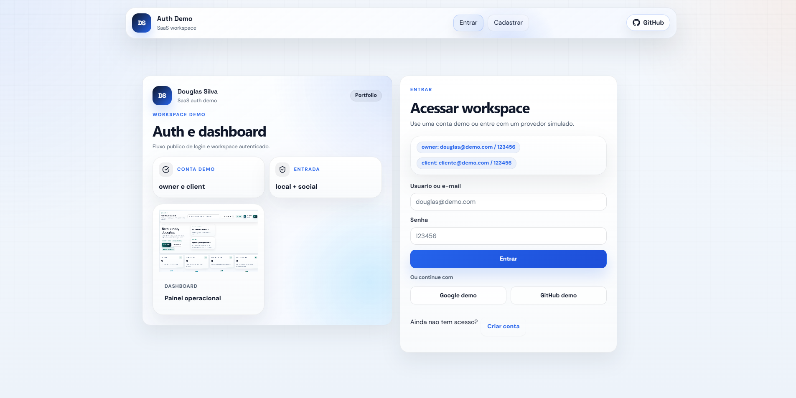

# SaaS Auth Dashboard Demo

Demo publica de autenticacao com login, cadastro, sessao persistente, dashboard autenticado e edicao de perfil.



## Fluxos incluidos

- login local
- login social demo
- cadastro de nova conta
- sessao persistente
- dashboard autenticado
- perfil editavel

## Credenciais demo

- owner: `douglas@demo.com` / `123456`
- client: `cliente@demo.com` / `123456`

## Stack

- React
- Vite
- React Router
- React Icons

## Como rodar

```bash
npm install
npm run dev
```

## Scripts

```bash
npm test
npm run lint
npm run build
npm audit
```

## Estrutura principal

- `src/context/AuthContext.jsx`: sessao local e contas demo
- `src/pages/Login.jsx`: entrada local e social simulada
- `src/pages/Register.jsx`: criacao de conta
- `src/pages/Dashboard.jsx`: shell autenticado
- `src/pages/Profile.jsx`: edicao de perfil

## Observacoes

- Persistencia local via `localStorage`.
- Nao depende da API real do produto privado.
- Não possui backend, OAuth real ou autenticação de produção. Contas, senhas em texto simples e tokens simulados existem somente para a demo local.
- Ideal para portfolio publico focado em auth e UX de workspace.

<!-- portfolio-showcase:start -->
## Showcase e entrevista

- Showcase local: `showcase/README.md`
- Roteiro de video: `showcase/video-script.md`
- Lista de cenas: `showcase/scenes.md`
- Legendas sugeridas: `showcase/captions.md`
- Guia de entrevista: `docs/INTERVIEW_GUIDE.md`
- Validado em 26/07/2026: testes, lint, build, auditoria de dependências e fluxo local
- Demo: https://saas-auth-dashboard-demo.vercel.app
- GitHub: https://github.com/Beckerr11/saas-auth-dashboard-demo
<!-- portfolio-showcase:end -->
